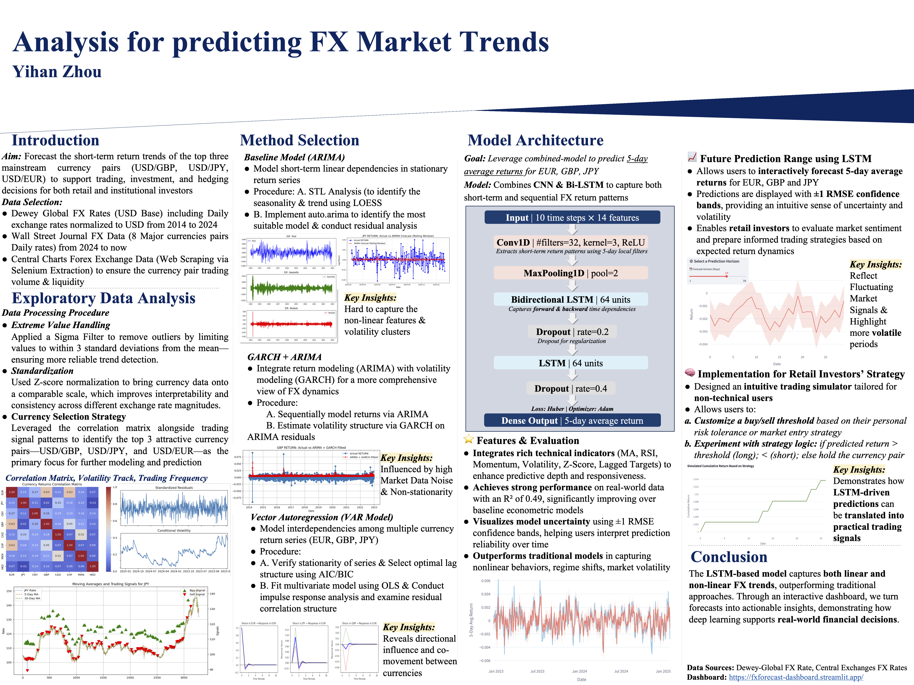

An **interactive analytics and forecasting dashboard** for global FX markets, combining time-series analysis with **LSTM-based return forecasting** to support exploratory analysis and short-horizon decision-oriented scenario evaluation.

The system enables users to **analyze historical return dynamics**, evaluate model performance on held-out periods, and **simulate future FX return trajectories** across major currencies, providing a practical framework for decision-oriented financial analysis.

<!--more-->
